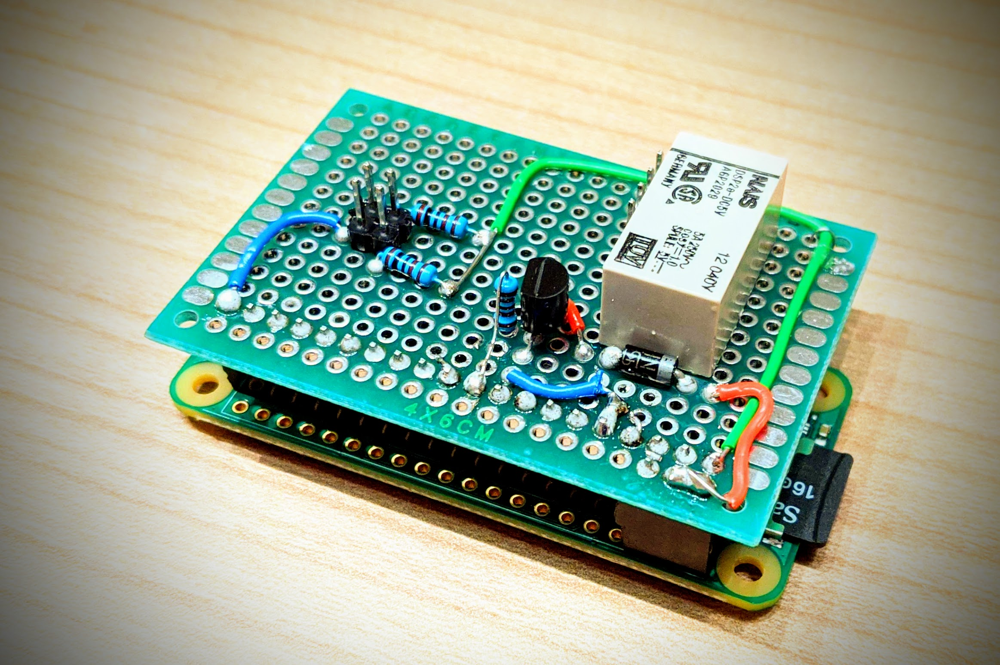

# dooropener
The project "dooropener" serves to detect the state of my garage (open/closed). The two buttons S1 and S2 determine the position of the garage door. 
The relay simulates a push button with which the garage door can be opened and closed. The app looks every evening at 21:00 if the door is closed. 
If it is not closed it send's a notofication.
 
 
app and server configuration: 
You have to configure in the app file [MainActivity.kt](app\app\src\main\java\com\scherer\garage\MainActivity.kt) the port and the ip on witch the python server listen. 
 
Then you have to configure the same port on that the python server listen for requests in file [door_server.py](door_server\door_server.py). 
 
 
 
wiring: 

 
The folder [app](app) is the source for the android app (in kotlin) 
In the folder [door_server](door_server) is python script for the raspberry pi zero w. It work only with pathon 2.7 because the gpio library not working with 3.x  
In the folder [test_client](test_client) there is a python script for testing the server.
 
 
security: 
For request the actual garage status, there is no security level. For open or close the door, ther is a sign/verify RSA security implemented. 
By on open or close request from the app, the server send a UTC timestamp to the app. The app signed the timestam with its own privat RSA key. Then the app
send this signed timestamp back to the server, and the server verify it with the puplic key. The public/private RSA key will generated by the first start of the app.
The private key will stored in the androd keystore. The public key will store in the app foulder "device/Android/data/com.scherer.garage/files/garage/public.pem". This public
key file have to store on the python sever in the same foulder as the python script. MAYBE you have to delet the "new line" in the public key file.
 
 
my variant (not my best work :-)) 

 
 
the layout of the app 
